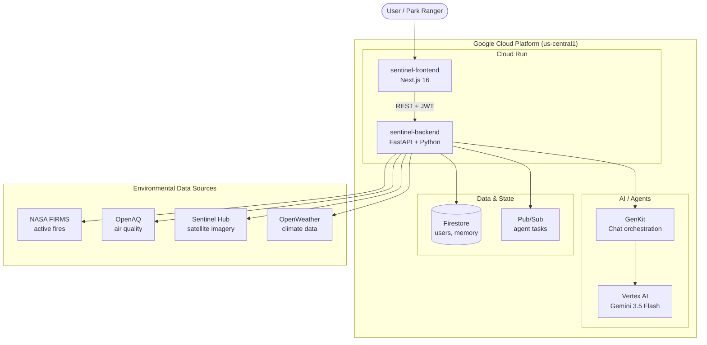
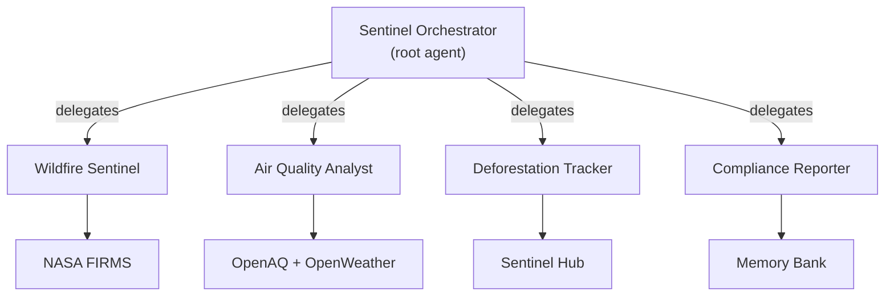
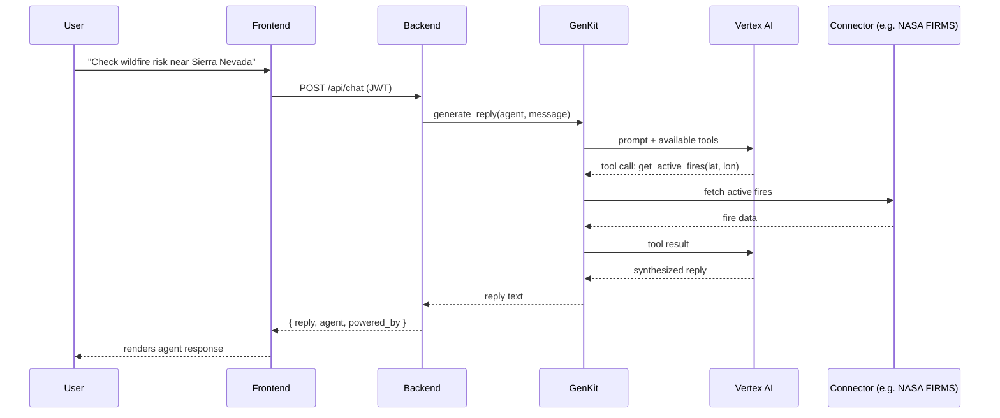

# Sentinel — Architecture

Sentinel is an enterprise agent fleet for environmental intelligence. This document describes the system architecture, components, and data flow.

## High-Level Overview



## Components

### Frontend — `sentinel-frontend`
- **Stack:** Next.js 16 (App Router), React, TypeScript, Tailwind CSS v4, shadcn/ui
- **Hosting:** Cloud Run (scales to zero)
- **Responsibilities:**
  - Authentication UI (login, signup, etc.)
  - Console dashboard (fleet status, agents, registry, memory, observability, connectors, settings)
  - Chat interface for conversing with agents
  - Calls the backend via REST with JWT bearer tokens

### Backend — `sentinel-backend`
- **Stack:** Python 3.12, FastAPI, Uvicorn
- **Hosting:** Cloud Run (scales to zero)
- **Modules:**
  - `api/` — REST route handlers (auth, agents, fleet, registry, memory, connectors, observability, settings, chat)
  - `agents/` — ADK agent definitions (orchestrator + wildfire, air quality, deforestation, compliance)
  - `chat/` — GenKit-powered conversational layer with connector tools
  - `connectors/` — Environmental data source clients
  - `identity/` — JWT auth + agent identity
  - `memory/` — Memory Bank integration
  - `gateway/` — Routing + Model Armor middleware
  - `observability/` — OpenTelemetry tracing + audit logging
  - `registry/` — Agent Registry client

### AI / Agents
- **Gemini 3.5 Flash:** Powers agent reasoning and chat responses. Supports two auth paths — Vertex AI (service account credentials) or the Gemini API (API key), configurable via environment variables.
- **GenKit:** Orchestrates chat flows and registers connectors as callable tools
- **Google ADK:** Framework for defining the agent fleet

### Data & State
- **Firestore:** User accounts, agent memory, persistent state
- **Pub/Sub:** Async agent task queue for long-running background execution

### Environmental Data Sources
| Source | Purpose | Used By |
|--------|---------|---------|
| NASA FIRMS | Active fire hotspots (MODIS/VIIRS) | Wildfire Sentinel |
| OpenAQ | Air quality sensor data | Air Quality Analyst |
| Sentinel Hub | Satellite imagery, NDVI | Deforestation Tracker |
| OpenWeather | Weather + pollution forecast | Air Quality Analyst |

## Agent Fleet



The **Orchestrator** receives user requests and delegates to the appropriate specialist sub-agent. Each sub-agent has its own scoped tools (data connectors) and persistent memory.

## Request Flow — Chat Example



## Security & Governance

- **Authentication:** JWT tokens (bcrypt-hashed passwords), verified on protected endpoints
- **Agent Identity:** Each agent has a scoped identity for zero-trust access control
- **Agent Gateway:** Routes requests and enforces policies
- **Model Armor:** Screens inputs/outputs for prompt injection, tool poisoning, and PII leaks
- **CORS:** Restricted to the deployed frontend origin
- **Secrets:** Never committed to the repo; injected as Cloud Run environment variables at deploy time

## Observability

- **OpenTelemetry:** Distributed tracing exported to Cloud Trace
- **Audit logging:** Every agent action logged with timestamp, agent identity, and result
- **Reasoning traces:** End-to-end chains showing each agent decision and tool call

## Deployment

Both services deploy from source to Cloud Run:

```bash
# Frontend
gcloud run deploy sentinel-frontend --source ./frontend --region us-central1 \
  --set-env-vars NEXT_PUBLIC_API_URL=<backend-url>

# Backend
gcloud run deploy sentinel-backend --source ./backend --region us-central1 \
  --set-env-vars GCP_PROJECT_ID=<project>,GOOGLE_CLOUD_PROJECT=<project>,...
```

- **Scale to zero:** Both services idle when not in use
- **Gemini auth:** Set `GEMINI_API_KEY` to use the Gemini API, or configure Vertex AI via the service account's `roles/aiplatform.user` binding and `GOOGLE_CLOUD_PROJECT` / `GOOGLE_CLOUD_LOCATION`

## Technology Summary

| Layer | Technology |
|-------|-----------|
| Frontend | Next.js 16, React, TypeScript, Tailwind CSS v4, shadcn/ui, Lucide React |
| Backend | Python 3.12, FastAPI, Uvicorn |
| AI Model | Gemini 3.5 Flash (via Vertex AI or Gemini API) |
| Agent Framework | Google ADK + GenKit |
| Auth | JWT (PyJWT) + bcrypt |
| Database | Firestore |
| Messaging | Pub/Sub |
| Observability | OpenTelemetry → Cloud Trace |
| Hosting | Cloud Run |
| CI/CD | GitHub Actions |
